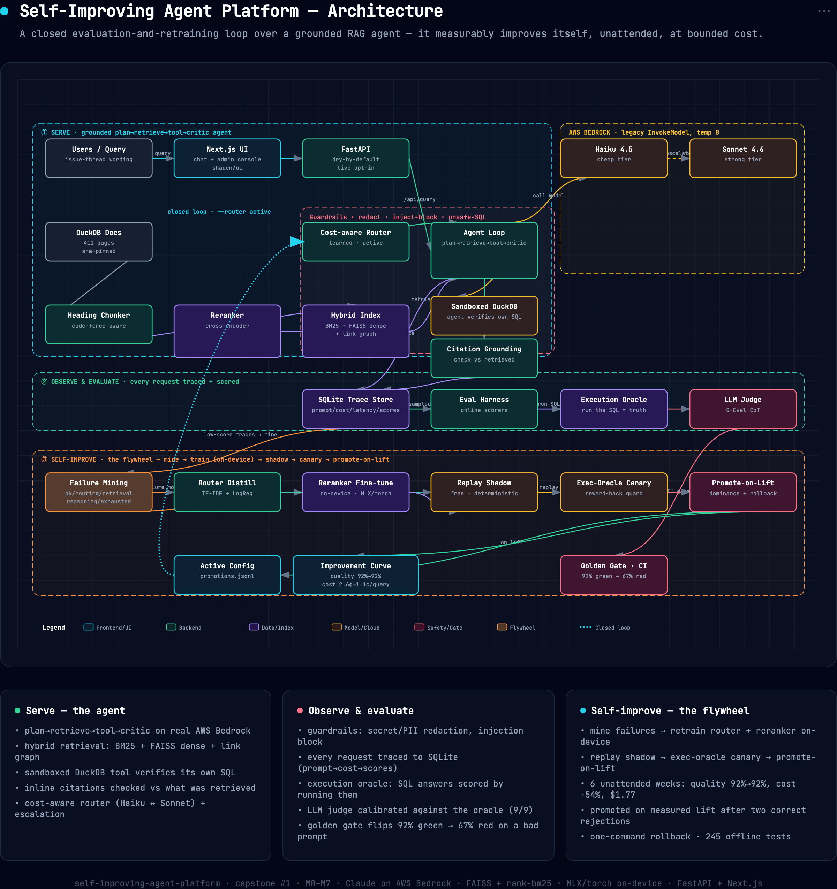
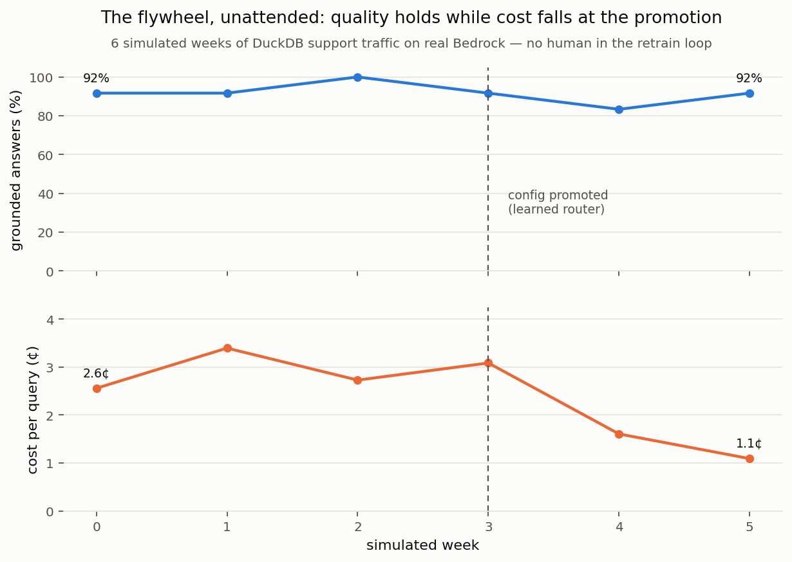

# Self-Improving Domain Agent Platform ("the RAG-agent OS")

> A multi-tenant platform where an organization drops in its documents + tools and a
> fleet of LLM agents answers, acts, and **measurably improves over time** through a
> closed evaluation-and-retraining loop — running on an Apple M1 (8 GB) laptop, with
> heavy reasoning on the Claude API and the parts that improve fine-tuned on-device.

**Status:** ✅ **All 8 milestones (M0–M7) built and measured** (2026-07-24). The only open
items are a 60–90s screen recording and an optional public cloud deploy — the whole system
runs locally today. Ingestion, a measured retrieval stack, a grounded tool-using agent,
guardrails + tracing, a continuous eval harness with a CI gate, a **closed self-improvement
loop on both components** (router distillation + on-device reranker fine-tune), and **the
headline improvement curve** all run end to end against real AWS Bedrock; 245 offline tests
pass. The **product surface** ships too: a **FastAPI backend** (`backend/src/api`) and a
**Next.js chat UI + admin console** (`frontend/`), runnable as a **`docker compose up`
stack**. Built milestone by milestone (see [`docs/02-build-plan.md`](docs/02-build-plan.md)).

## Architecture at a glance



Three planes — **① Serve** a grounded plan→retrieve→tool→critic agent, **② Observe &
evaluate** every request (trace → execution oracle → judge → CI gate), **③ Self-improve**
via the closed flywheel (mine → retrain on-device → shadow → canary → promote-on-lift). The
dashed cyan line is the loop: a promoted config flows back into the live router. Open
[`docs/assets/architecture.html`](docs/assets/architecture.html) for the interactive version
(export to PNG/PDF from the ⋯ menu).

## The headline



**Six simulated weeks of support traffic, no human in the retrain loop, $1.77 total:**
quality held **92% → 92%** while cost fell **2.6¢ → 1.1¢ per query**. The flywheel rejected
its candidate twice for insufficient evidence (the second rejection *triggered* the bounded
shadow sample that produced the missing evidence), promoted at week 3 on measured lift, and
then declined to churn when nothing further could be gained. Full analysis in
[`eval/sim/FINDINGS.md`](backend/eval/sim/FINDINGS.md).

**The flywheel turned (M5 stage 1):** traces → failure mining → retrain → replay shadow →
execution-oracle canary → promote-on-dominance, fully automated per cycle. Cycle 1 was
**rejected** (no evidence of lift — logged, because a flywheel that only records wins is
marketing). Cycle 2 **promoted**: quality held 100% → 100% at **−25% cost** on the holdout,
priced by a live shadow A/B where the incumbent heuristic routed 14/14 queries to the strong
tier for **$0.87 and 11/14 grounded** while always-cheap delivered **$0.19 and 14/14
grounded**. The first promotion is honestly a *demotion* — a declared-degenerate always-cheap
policy that kills the router waste M2 measured manually. `--router active` serves whatever
the log last promoted; rollback is one command. Details in
[`eval/flywheel/FINDINGS.md`](backend/eval/flywheel/FINDINGS.md).

**Both components close the loop (M5 stage 2):** the reranker fine-tune runs the same
machinery one component over — mine 68 (query, good, bad) triples off the real first stage,
**fine-tune the cross-encoder on-device**, replay-shadow it against the base reranker,
decide. It was **rejected, correctly**: the fine-tune lifted recall@3/@10 and nDCG but
*regressed rank 1* (0.357 → 0.314) with MRR flat, so the dominance gate declined it. That
extends the M1 result — fine-tuning **deepens** "the reranker never fixes rank 1" rather than
breaking it; rank 1 is an agent problem, not a ranking one. Details in
[`eval/flywheel/RERANKER_FINDINGS.md`](backend/eval/flywheel/RERANKER_FINDINGS.md).

**Eval harness (M4):** online scorers on every trace, an **execution-based objective oracle**
(SQL answers are checked by *running* them, not judged by a model), an LLM-judge calibrated
*against* that oracle, a golden eval set, and a CI gate. The gate flips **92% green → 67% red**
on a deliberately-worse prompt. Two findings: a gate on execution alone would have missed the
regression (the bad prompt collapsed citations, not SQL), and the one judge-vs-execution
disagreement turned out to be the *golden case* being wrong, which the judge caught. Details in
[`eval/golden/FINDINGS.md`](backend/eval/golden/FINDINGS.md).

**Guardrails + tracing (M3):** input/tool/output gates (secret + PII redaction, injection
block, unsafe-SQL policy), per-request traces to SQLite, and ordered provider failover. On a
live run every gate fired — an injection **blocked at $0.00** before reaching the model, a
pasted AWS key **redacted** before it hit the model or the trace. The finding: redaction is
load-bearing but **not semantically free** — a bare `[AWS_ACCESS_KEY]` placeholder read to the
model as literal user input and it misdiagnosed the question. Details in
[`eval/agent/M3_FINDINGS.md`](backend/eval/agent/M3_FINDINGS.md).

**Agent today:** plan → retrieve → tool → critic, with inline citations checked against what
was actually retrieved, a sandboxed DuckDB tool the agent uses to verify its own SQL, and a
cost-aware router. On 5 real questions: **5/5 grounded, 0 invalid citations, $0.25.** The
headline finding is negative — **the router cost 2.7× an always-cheap baseline for no
measurable grounding gain**, with one question consuming 75% of the run. Details in
[`eval/agent/FINDINGS.md`](backend/eval/agent/FINDINGS.md).

**Retrieval today:** dense + link-graph boost, **R@1 0.371 / R@10 0.843 / MRR 0.573 at ~11 ms
per query** on 35 labeled queries. Full numbers in
[`eval/retrieval/report.md`](backend/eval/retrieval/report.md), analysis in
[`eval/retrieval/FINDINGS.md`](backend/eval/retrieval/FINDINGS.md). Three results worth the click: a
naive equal-weight hybrid scored *worse* than dense alone; the cross-encoder reranker cost
400–1,000× the latency and never once improved rank 1; and the link graph failed at the
multi-hop job it was built for.

**Domain:** open-source support agent over the **DuckDB documentation** (411 pages,
`docs/current`, pinned by commit sha). Rationale in
[`docs/00-what-it-is.md`](docs/00-what-it-is.md) — briefly, it avoids overlapping the two
existing SEC-filing repos, and DuckDB is niche enough that Claude cannot answer from
memory, so a retrieval failure shows up as a wrong answer instead of being masked.

**Capstone #1 of 3.** Sibling repos: `ondevice-model-lifecycle`,
`realtime-decision-intelligence`. Estimated effort: **6–12 months solo**.

---

## The one-sentence pitch

Most RAG/agent demos are static — they answer the same way on day 100 as day 1. This
platform closes the loop: every production trace is scored, failures are mined into new
eval cases, a **small reranker/router is re-fine-tuned on-device**, the new
config is shadow-tested, and it's promoted **only on measured lift**. The headline
deliverable is a **before/after quality curve proving the system improves with no human
in the retrain loop, at bounded cost.**

## Why this project exists

The mid-2026 hiring signal (see `../research.md`) says the gap in a strong AI portfolio
is not another RAG variant or eval framework — those are baseline. The gap is **one
integrated, deployed, domain-grounded, evaluated, actually-used system**. This is that
system, and the self-improvement flywheel is the differentiator nobody else ships.

It also answers the Gartner prediction that >40% of agentic projects get cancelled: this
agent comes with the eval + governance to prove it works.

## Headline metric (the thing to demo)

A chart with **weeks on the x-axis and answer quality (faithfulness / task-success) on
the y-axis**, trending up, annotated with each automated promotion event — while a
second line shows cost-per-query staying flat or falling. If that curve goes up without
a human touching the retrainer, the project succeeds.

## What runs where (Apple M1, 8 GB — the core constraint)

| Role | Where |
|---|---|
| Heavy agent reasoning, LLM-judge | **Claude API / AWS Bedrock** (cloud, temp 0) |
| Cheap router tier, offline demo | **Local Qwen2.5-1.5B / Llama-3.2-1B** via llama.cpp / MLX (Metal) |
| Reranker + embedder + router (the parts that improve) | **MLX-LoRA / QLoRA fine-tuned on-device (≤1.5B)** |
| Vector + keyword retrieval | FAISS + BM25 (laptop-light; no pgvector) |
| Multi-tenant K8s scale-out | Optional, documented cloud step — **not** required on the laptop |

Usable model memory on this machine is ~4–5 GB after the OS. Everything is scoped to fit.

## Architecture (one glance)

```
             ┌─────────────── Continuous Eval Flywheel ───────────────┐
             │                                                         │
  docs ──▶ Ingestion ──▶ Hybrid Index (BM25 + dense + graph)          │
                              │                                        │
  query ─▶ Agent (plan→retrieve→tool→critic) ─▶ answer + citations    │
                              │                          │             │
                     tools via MCP            every trace scored online│
                              │                          │             │
                     cost-aware model router    sampled ▶ LLM-judge    │
                                                         │             │
                        mine failures ▶ new eval cases ▶ MLX-LoRA ─────┘
                              retrain reranker/router ▶ shadow ▶ promote-on-lift
```

Full detail: [`docs/01-architecture.md`](docs/01-architecture.md).

## Repository layout (target)

```
self-improving-agent-platform/
├── README.md
├── docs/
│   ├── 00-what-it-is.md      # problem, goals, success criteria
│   ├── 01-architecture.md    # subsystems, data flow, interfaces
│   ├── 02-build-plan.md      # ← phased, step-by-step milestones (build from here)
│   └── 03-setup.md           # env, models, keys, first run
├── backend/                  # the Python platform (everything M0–M6 measured) + the API
│   ├── src/                  # ingestion, retrieval, agent, guardrails, eval, flywheel, sim, api
│   ├── tests/                # 245 offline tests — no network, no cloud spend
│   ├── eval/                 # labeled sets, golden cases, FINDINGS per milestone
│   ├── configs/              # promotion log, active config, promoted router artifacts
│   ├── data/                 # gitignored; fetched by scripts
│   ├── Dockerfile · docker-entrypoint.sh · Makefile · requirements.txt · pyproject.toml
├── frontend/                 # Next.js chat UI + admin console (M7) + Dockerfile
├── docker-compose.yml        # the full local stack: `docker compose up --build`
```

## Quickstart — the whole stack in one command (Docker)

```bash
docker compose up --build
# frontend -> http://localhost:3000   (chat + /dashboard)
# backend  -> http://localhost:8000   (/api/health, /api/query, ...)
```

First boot fetches the DuckDB corpus and builds the index into a named volume (a few
minutes); later boots reuse it. The backend is **dry by default** — the chat answers from
the real index with templated prose and zero spend. To allow real Bedrock: put AWS creds in
`backend/.env` and run `SIAP_ALLOW_LIVE=1 docker compose up`, then flip the **live** toggle
in the chat.

## Quickstart — from source (development)

```bash
# 0. Everything Python runs from backend/
cd backend

# 1. Env (personal conda env, never base; see ~/.claude/CLAUDE.md)
source ~/miniconda3/etc/profile.d/conda.sh && conda activate personal
make install

# 2. Fetch the corpus (411 DuckDB doc pages -> data/corpus/duckdb, gitignored)
make corpus

# 3. Build the hybrid index (BM25 + FAISS)
make ingest

# 4. Tests: 245 offline, no network, no cloud spend
make test

# 5. Retrieval eval (add eval-full for the slow cross-encoder arms)
make eval

# 6. The agent. `agent-dry` costs nothing; `agent-demo` SPENDS on real Bedrock (~$0.25)
make agent-dry
set -a; source ~/.env; set +a && make agent-demo

# 7. View persisted request traces (cost, latency, grounding, guard actions)
make traces

# 8. The eval gate. `golden` is free (replay); `golden-live` SPENDS on Bedrock (~$0.30)
make golden

# 9. The flywheel. `flywheel-cycle` is free (replay shadow); `flywheel-traffic` SPENDS (~$1)
make flywheel-cycle
make flywheel-log

# 10. The product surface (M7): FastAPI backend + Next.js frontend
make api                       # http://127.0.0.1:8000 — dry-only unless SIAP_ALLOW_LIVE=1
cd ../frontend && npm install && npm run dev   # http://localhost:3000 (chat + /dashboard)
```

The API is **dry by default**: `POST /api/query` uses the fake provider (numbers labelled
fabricated) unless the request asks `live: true` *and* the server was started with
`SIAP_ALLOW_LIVE=1` — spending requires both the caller and the operator to opt in.

Every agent run is bounded three ways — a per-question spend limit that raises rather than
continuing, a run-wide model-call ceiling, and a search budget. All three were added because
a run hit them, not as a precaution.

Ingest defaults to the `hashing` embedder, which needs no download and indexes the whole
corpus in **0.7 s** — that keeps the test suite and iteration fast. For real semantic
retrieval, pass a model (**65 s** for 4,556 chunks on an M1):

```bash
python -m src.ingest data/corpus/duckdb --tenant duckdb --rebuild \
  --embedder sentence-transformers/all-MiniLM-L6-v2 \
  --query "how do I filter the result of a window function"
```

Later milestones add the local GGUF cheap tier and cloud creds (see
[`docs/03-setup.md`](docs/03-setup.md)); neither is needed for the steps above.

## How to build it

Read the docs in order, then work **milestone by milestone** through
[`docs/02-build-plan.md`](docs/02-build-plan.md). Each milestone is independently
demoable and ends with a concrete artifact. Do **not** try to build all subsystems at
once — the flywheel only makes sense once a basic agent + eval exist.

## Tech stack

Python 3.12 · Claude (Anthropic / Bedrock) · llama.cpp + MLX (local models) · FAISS +
rank-bm25 · networkx (GraphRAG) · MCP · FastAPI + async workers · Redis · SQLite/Postgres
· Next.js (admin console) · Prometheus/Grafana · DVC/MLflow · GitHub Actions · Docker.

## License

MIT — see [`LICENSE`](LICENSE).

The DuckDB documentation corpus is **not** covered by this license. It is fetched at build
time from [duckdb/duckdb-web](https://github.com/duckdb/duckdb-web) under its own terms and
is never committed here.
